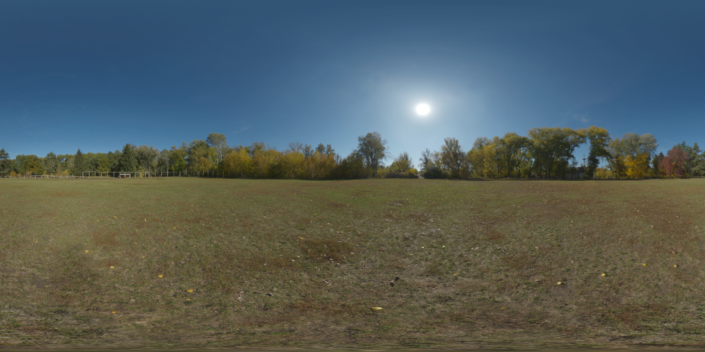
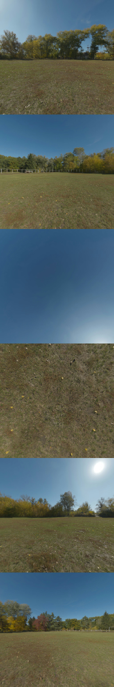

# Generate Cubemap Strip from Equirectangular 360 Image

Example usage:
```bash
cargo run --release autumn_park_1k.exr autumn_park_1k_out.exr
```
Optionally end with `bilinear` or `nearest` for sampling type

Used to convert panoramic HDRIs to cube maps. See https://polyhaven.com/hdris for examples of panoramic HDRIs.

Under active development, only nearest neighbor or bilinear sampling is currently implemented.

Supports any format that [**Image** supports](https://docs.rs/image/latest/image/codecs/index.html#supported-formats)  

Example input:



Example output:

